# 🏭 SynthDataFactory

[🇪🇸 Español](README.md) | [🇬🇧 English](README.en.md)

---

**The Ultimate Open Source Synthetic Data Generator.**

**SynthDataFactory** is an Open Source, containerized, event-driven platform to generate complex datasets, simulate IoT traffic, and test Big Data systems in real-time.

---

## 📋 Key Features

This is not just a simple Python script. It's a complete microservices architecture designed for scalability and ease of use.

- **🎨 No-Code Visual Design**: Intuitive web interface (Vue.js + Bootstrap 5) to design your data models without coding.

- **📤 Multi-Output (Sinks)**: Send data wherever you need:
  - **📂 Files**: JSON, CSV, XML, TOML (Direct download).
  - **📡 IoT/Messaging**: MQTT, Kafka, RabbitMQ.
  - **🌐 Web**: HTTP Webhooks (POST).

- **🤖 Intelligent Generation**:
  - Realistic data types (Names, Emails, UUID, Geo, IPs).
  - Weighted distributions (e.g., 80% "OK", 20% "Error").
  - Numeric ranges, dynamic dates, and configurable nulls (% of dirty data).

- **⚡ Non-Blocking Architecture**: Uses Redis and background Workers. You can launch 50 simultaneous simulations without freezing the interface.

- **🎛️ Total Control**: Start, Stop (immediate), and real-time progress monitoring.

- **🏭 Multi-Sensor Mode**: Simulate device fleets (1 to 1000+) by injecting rotating unique IDs.

---

## 🏗️ Architecture

The system consists of 4 orchestrated containers:

- **Frontend (Nginx)**: Serves the UI and acts as a Reverse Proxy.
- **API (FastAPI)**: Receives commands and manages files.
- **Redis**: Message broker and in-memory state storage.
- **Worker (Python RQ)**: The "worker" that executes massive data generation and manages connections (Kafka, MQTT, etc.).

```mermaid
graph LR
    User[👤 User] -->|HTTP| Frontend[Nginx Frontend]
    Frontend -->|Proxy| API[FastAPI Backend]
    API -->|Enqueue Tasks| Redis[(Redis)]
    Redis -->|Consume Jobs| Worker[RQ Worker]
    Worker -->|Generate Data| Sinks[📂 Files / 📡 Kafka / 🌐 HTTP]
```



---

## 🚀 Installation and Deployment

### Prerequisites

- Docker and Docker Compose installed.

### Steps

1. **Clone the repository**:

```bash
git clone https://github.com/your-username/mega-simulator.git
cd mega-simulator
```

2. **Start the services**:

```bash
docker-compose up --build
```

3. **Access the platform**: 

Open your browser and go to: 👉 **http://localhost**

---

## 📖 Usage Guide

### 1. Global Configuration

Define the general behavior of the simulation:

- **Name**: Task identifier.
- **Records**: How many rows/messages you want to generate.
- **Delay**: Wait time between messages (0 for maximum speed).
- **Devices**: If you set > 1, the system will automatically inject a `sensor_id` field that will rotate between generated virtual IDs.

### 2. Choose Destination (Sink)

Select where you want the data to go:

- **File**: Will be saved on the server and you can download them from the sidebar. Supports JSON, CSV, XML, and TOML.
- **MQTT**: Requires Host, Port, and Topic.
- **Kafka**: Requires Bootstrap Servers and Topic.
- **HTTP**: Requires endpoint URL (performs POST of JSON).
- **RabbitMQ**: Requires Host and Queue name.

### 3. Design the Model (Schema)

Add fields dynamically:

- **Primitive Types**: Integer, Float (with min/max), Boolean.
- **Semantic Data**: Name, Email, City, UUID, IPv4.
- **Choice (List)**: Define your own options (e.g., Red, Green, Blue).
  - **Weights**: You can define probabilities (e.g., 0.8, 0.1, 0.1) so "Red" appears 80% of the time.
- **Nulls**: Define a `% Null` to simulate dirty data or read failures.

### 4. Launch and Monitor

1. Click **"LAUNCH NOW"**. You'll see the progress in the right sidebar.
2. You can pause the simulation at any time with the **STOP** button.
3. If you chose "File", the download button 📥 will appear when finished.

---

## 🛠️ Local Development

If you want to modify the code (Python or JS):

### Folder Structure

```
mega-simulator/
├── docker-compose.yml
├── backend/
│   ├── main.py          # API Endpoints
│   ├── worker.py        # Background process logic
│   ├── core/
│   │   ├── generator.py # Faker/Random logic
│   │   └── sinks.py     # Connectors (Kafka, MQTT...)
└── frontend/
    ├── src/             # HTML/JS (Vue)
    └── nginx.conf       # Proxy Config
```

Docker volumes are configured so that code changes are reflected when restarting the container, although for new libraries you need to rebuild.

### Useful Commands

**Restart forcing compilation (new libraries)**:

```bash
docker-compose down
docker-compose build --no-cache
docker-compose up
```

**View logs in real-time**:

```bash
docker-compose logs -f
```

---

## 🤝 Contributing

Pull Requests are welcome!

1. **Fork** the project.
2. Create your feature branch (`git checkout -b feature/AmazingFeature`).
3. Commit your changes (`git commit -m 'Add some AmazingFeature'`).
4. Push to the branch (`git push origin feature/AmazingFeature`).
5. Open a **Pull Request**.

---

## 📄 License

Distributed under the MIT License. See `LICENSE` for more information.

---

**Made with ❤️ and lots of ☕ Coffee.**