# 🏭 SynthDataFactory

[🇪🇸 Español](README.md) | [🇬🇧 English](README.en.md)

---

**The Ultimate Open Source Synthetic Data Generator.**

**SynthDataFactory** is an Open Source, containerized, event-driven platform to generate complex datasets, simulate IoT traffic, and test Big Data systems in real-time.

---

## 📋 Key Features

This is not just a simple Python script. It's a complete microservices architecture designed for scalability and ease of use.

- **🎨 No-Code Visual Design**: Intuitive web interface (Vue.js + Bootstrap 5) to design your data models without coding.

- **💾 Smart Persistence**: 
  - **Auto-save**: Your configuration is automatically saved as you work.
  - **Reusable Templates**: Save, load, and duplicate configurations with custom names.
  - **Export/Import**: Share configurations between teams as JSON files.

- **📤 Multi-Output (Sinks)**: Send data wherever you need:
  - **📂 Files**: JSON, CSV, XML, TOML (Direct download).
  - **📡 IoT/Messaging**: MQTT, Kafka, RabbitMQ.
  - **🌐 Web**: HTTP Webhooks (POST).

- **🤖 Intelligent Generation**:
  - Realistic data types (Names, Emails, UUID, Geo, IPs).
  - Weighted distributions (e.g., 80% "OK", 20% "Error").
  - Numeric ranges, dynamic dates, and configurable nulls (% of dirty data).

- **⚡ Non-Blocking Architecture**: Uses Redis and background Workers. You can launch 50 simultaneous simulations without freezing the interface.

- **🎛️ Total Control**: Start, Stop (immediate), and real-time progress monitoring.

- **🏭 Multi-Sensor Mode**: Simulate device fleets (1 to 1000+) by injecting rotating unique IDs.

- **🔍 Preview Mode**: Visualize the generated JSON before launching the simulation.

- **✅ Automatic Validation**: The system verifies that the configuration is valid before execution.

---

## 🏗️ Architecture

The system consists of 4 orchestrated containers:

- **Frontend (Nginx)**: Serves the UI and acts as a Reverse Proxy.
- **API (FastAPI)**: Receives commands and manages files.
- **Redis**: Message broker and in-memory state storage.
- **Worker (Python RQ)**: The "worker" that executes massive data generation and manages connections (Kafka, MQTT, etc.).

```mermaid
graph LR
    User[👤 User] -->|HTTP| Frontend[Nginx Frontend]
    Frontend -->|Proxy| API[FastAPI Backend]
    API -->|Enqueue Tasks| Redis[(Redis)]
    Redis -->|Consume Jobs| Worker[RQ Worker]
    Worker -->|Generate Data| Sinks[📂 Files / 📡 Kafka / 🌐 HTTP]
```



---

## 🚀 Installation and Deployment

### Prerequisites

- Docker and Docker Compose installed.

### Steps

1. **Clone the repository**:

```bash
git clone https://github.com/JesusRosaB/SynthDataFactory.git
cd SynthDataFactory
```

2. **Start the services**:

```bash
docker-compose up --build
```

3. **Access the platform**: 

Open your browser and go to: 👉 **http://localhost**

---

## 📖 Usage Guide

### 1. Global Configuration

Define the general behavior of the simulation:

- **Name**: Task identifier.
- **Records**: How many rows/messages you want to generate.
- **Delay**: Wait time between messages (0 for maximum speed).
- **Devices**: If you set > 1, the system will automatically inject a `sensor_id` field that will rotate between generated virtual IDs.

💡 **Tip**: Your configuration is automatically saved. If you reload the page, everything will remain as you left it.

### 2. Choose Destination (Sink)

Select where you want the data to go:

- **File**: Will be saved on the server and you can download them from the sidebar. Supports JSON, CSV, XML, and TOML.
- **MQTT**: Requires Host, Port, and Topic.
- **Kafka**: Requires Bootstrap Servers and Topic.
- **HTTP**: Requires endpoint URL (performs POST of JSON).
- **RabbitMQ**: Requires Host and Queue name.

### 3. Design the Model (Schema)

Add fields dynamically:

- **Primitive Types**: Integer, Float (with min/max), Boolean.
- **Semantic Data**: Name, Email, City, UUID, IPv4.
- **Choice (List)**: Define your own options (e.g., Red, Green, Blue).
  - **Weights**: You can define probabilities (e.g., 0.8, 0.1, 0.1) so "Red" appears 80% of the time.
- **Nulls**: Define a `% Null` to simulate dirty data or read failures.

🔍 **Use Preview**: Before launching, click "Preview" to see what the generated JSON will look like.

### 4. Template Management

**SynthDataFactory** now includes a powerful configuration management system:

#### Save a Template

1. Design your configuration (steps 1-3).
2. Go to the **"Templates"** tab in the sidebar.
3. Click **"Save Template"**.
4. Assign a descriptive name (e.g., "Temperature Sensors", "E-commerce Users").

#### Load a Template

1. Go to the **"Templates"** tab.
2. Click on the template you want to use.
3. Your configuration will load instantly!

#### Other Operations

- **Duplicate** 📋: Create a copy to experiment without losing the original.
- **Delete** 🗑️: Remove templates you no longer need.
- **Export** 💾: Download the current configuration as JSON.
- **Import** 📤: Load configurations from JSON files.

💡 **Use Case**: Create templates for each project or simulation type (IoT, E-commerce, Logs, etc.) and reuse them when needed.

### 5. Launch and Monitor

1. Click **"LAUNCH NOW"**. The system will automatically validate your configuration.
2. You'll see real-time progress in the **"Active"** tab of the sidebar.
3. You can pause the simulation at any time with the **STOP** button.
4. If you chose "File", the download button 📥 will appear in the **"Files"** tab when finished.

---

## 🎯 Improved Interface

The new version includes a reorganized interface with **3 tabs** in the sidebar:

### 📌 Sidebar Tabs

1. **🎬 Active**: 
   - Monitor ongoing simulations.
   - Real-time progress.
   - Immediate stop control.

2. **📑 Templates**: 
   - List of saved configurations.
   - Quick view: number of records and fields.
   - Actions: Load, Duplicate, Delete.
   - Export/Import configurations.

3. **📁 Files**: 
   - Generated files available for download.
   - List refresh button.
   - Direct download with one click.

---

## 🛠️ Local Development

If you want to modify the code (Python or JS):

### Folder Structure

```
SynthDataFactory/
├── docker-compose.yml
├── backend/
│   ├── main.py          # API Endpoints
│   ├── worker.py        # Background process logic
│   ├── core/
│   │   ├── generator.py # Faker/Random logic
│   │   └── sinks.py     # Connectors (Kafka, MQTT...)
└── frontend/
    ├── src/
    │   └── index.html   # Main UI (Vue.js)
    └── nginx.conf       # Proxy Config
```

Docker volumes are configured so that code changes are reflected when restarting the container, although for new libraries you need to rebuild.

### Useful Commands

**Restart forcing compilation (new libraries)**:

```bash
docker-compose down
docker-compose build --no-cache
docker-compose up
```

**View logs in real-time**:

```bash
docker-compose logs -f
```

**View logs for a specific service**:

```bash
docker-compose logs -f worker
docker-compose logs -f backend
```

---

## 🆕 Latest Version News

### v2.0 - "Smart Persistence"

✨ **New Features**:

- **🔄 Auto-save**: Configurations are automatically saved as you work.
- **📚 Template System**: Save, load, and manage multiple configurations.
- **📋 Duplicate Templates**: Experiment without losing your original configurations.
- **💾 Export/Import**: Share configurations between teams or projects.
- **🔍 JSON Preview**: Visualize the result before executing.
- **✅ Improved Validation**: The system verifies the configuration before launching.
- **🎨 Reorganized Interface**: Tab system for better organization.
- **🌐 Enhanced Multi-language**: Spanish and English with preference persistence.

### UX Improvements

- Visual auto-save indicator.
- Smooth transitions and animations.
- Hover effects for better interactivity.
- Enhanced modals for important actions.
- Clear validation messages.

---

## 💡 Use Cases

### 1. Big Data Systems Testing

Generate millions of realistic records to test your data pipeline:

```
Configuration: 1,000,000 records
Sink: Kafka Topic
Schema: user_id, timestamp, action, revenue
```

### 2. IoT Fleet Simulation

Simulate 500 sensors sending data every 5 seconds:

```
Configuration: 10,000 records
Devices: 500
Delay: 5 seconds
Sink: MQTT
Schema: temperature, humidity, battery, gps_lat, gps_lon
```

### 3. Development Test Data

Generate CSVs with user data for your application:

```
Configuration: 5,000 records
Sink: File (CSV)
Schema: name, email, city, age, subscription
```

### 4. API Load Testing

Bombard your API with realistic traffic:

```
Configuration: 100,000 records
Delay: 0 (maximum speed)
Sink: HTTP Webhook
Schema: request_id, endpoint, method, payload
```

---

## 🤝 Contributing

Pull Requests are welcome!

1. **Fork** the project.
2. Create your feature branch (`git checkout -b feature/AmazingFeature`).
3. Commit your changes (`git commit -m 'Add some AmazingFeature'`).
4. Push to the branch (`git push origin feature/AmazingFeature`).
5. Open a **Pull Request**.

### Areas for Improvement

- 🔌 New connectors (PostgreSQL, MongoDB, S3, etc.)
- 📊 Visualization of generated data
- 🔐 Authentication and multi-user
- 📈 Simulation metrics and statistics
- 🎲 More data types (nested JSON, Arrays, etc.)

---

## 📄 License

Distributed under the MIT License. See `LICENSE` for more information.

---

## 🙏 Acknowledgments

- [Faker](https://faker.readthedocs.io/) - Realistic data generation
- [FastAPI](https://fastapi.tiangolo.com/) - Modern API framework
- [Vue.js](https://vuejs.org/) - Progressive JavaScript framework
- [Redis](https://redis.io/) - In-memory storage
- [Python-RQ](https://python-rq.org/) - Background jobs

---

**Made with ❤️ and lots of ☕ Coffee.**