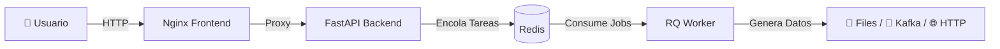

# 🏭 SynthDataFactory

[🇪🇸 Español](README.md) | [🇬🇧 English](README.en.md)

---

**The Ultimate Open Source Synthetic Data Generator.**

**SynthDataFactory** es una plataforma Open Source, contenerizada y basada en eventos para generar datasets complejos, simular tráfico IoT y probar sistemas de Big Data en tiempo real.

---

## 📋 Características Principales

Este no es un simple script de Python. Es una arquitectura completa de microservicios diseñada para escalabilidad y facilidad de uso.

- **🎨 Diseño Visual No-Code**: Interfaz web intuitiva (Vue.js + Bootstrap 5) para diseñar tus modelos de datos sin programar.

- **📤 Multi-Salida (Sinks)**: Envía datos a donde necesites:
  - **📂 Archivos**: JSON, CSV, XML, TOML (Descarga directa).
  - **📡 IoT/Messaging**: MQTT, Kafka, RabbitMQ.
  - **🌐 Web**: HTTP Webhooks (POST).

- **🤖 Generación Inteligente**:
  - Tipos de datos realistas (Nombres, Emails, UUID, Geo, IPs).
  - Distribuciones ponderadas (Ej: 80% "OK", 20% "Error").
  - Rangos numéricos, fechas dinámicas y nulos configurables (% de suciedad).

- **⚡ Arquitectura No Bloqueante**: Usa Redis y Workers en segundo plano. Puedes lanzar 50 simulaciones simultáneas sin que la interfaz se congele.

- **🎛️ Control Total**: Start, Stop (inmediato) y monitorización de progreso en tiempo real.

- **🏭 Modo Multi-Sensor**: Simula flotas de dispositivos (1 a 1000+) inyectando IDs únicos rotativos.

---

## 🏗️ Arquitectura

El sistema se compone de 4 contenedores orquestados:

- **Frontend (Nginx)**: Sirve la UI y actúa como Proxy Inverso.
- **API (FastAPI)**: Recibe las órdenes y gestiona los ficheros.
- **Redis**: Broker de mensajería y almacenamiento de estado en memoria.
- **Worker (Python RQ)**: El "obrero" que ejecuta la generación masiva de datos y gestiona las conexiones (Kafka, MQTT, etc.).



---

## 🚀 Instalación y Despliegue

### Requisitos Previos

- Docker y Docker Compose instalados.

### Pasos

1. **Clonar el repositorio**:

```bash
git clone https://github.com/JesusRosaB/SynthDataFactory.git
cd SynthDataFactory
```

2. **Arrancar los servicios**:

```bash
docker-compose up --build
```

3. **Acceder a la plataforma**: 

Abre tu navegador y ve a: 👉 **http://localhost**

---

## 📖 Guía de Uso

### 1. Configuración Global

Define el comportamiento general de la simulación:

- **Nombre**: Identificador de la tarea.
- **Registros**: Cuántas filas/mensajes quieres generar.
- **Delay**: Tiempo de espera entre mensajes (0 para máxima velocidad).
- **Dispositivos**: Si pones > 1, el sistema inyectará automáticamente un campo `sensor_id` que rotará entre IDs virtuales generados.

### 2. Elegir Destino (Sink)

Selecciona dónde quieres que vayan los datos:

- **File**: Se guardarán en el servidor y podrás descargarlos desde la barra lateral. Soporta JSON, CSV, XML y TOML.
- **MQTT**: Requiere Host, Puerto y Topic.
- **Kafka**: Requiere Bootstrap Servers y Topic.
- **HTTP**: Requiere la URL del endpoint (hace POST del JSON).
- **RabbitMQ**: Requiere Host y nombre de la Queue.

### 3. Diseñar el Modelo (Schema)

Añade campos dinámicamente:

- **Tipos Primitivos**: Entero, Flotante (con min/max), Booleano.
- **Datos Semánticos**: Nombre, Email, Ciudad, UUID, IPv4.
- **Choice (Lista)**: Define tus propias opciones (Ej: Rojo,Verde,Azul).
  - **Pesos**: Puedes definir probabilidades (Ej: 0.8, 0.1, 0.1) para que "Rojo" salga el 80% de las veces.
- **Nulos**: Define un `% Null` para simular datos sucios o fallos de lectura.

### 4. Lanzar y Monitorizar

1. Pulsa **"LANZAR AHORA"**. Verás el progreso en la barra lateral derecha.
2. Puedes pausar la simulación en cualquier momento con el botón **STOP**.
3. Si elegiste "File", aparecerá el botón de descarga 📥 al finalizar.

---

## 🛠️ Desarrollo Local

Si quieres modificar el código (Python o JS):

### Estructura de Carpetas

```
mega-simulator/
├── docker-compose.yml
├── backend/
│   ├── main.py          # API Endpoints
│   ├── worker.py        # Lógica del proceso en background
│   ├── core/
│   │   ├── generator.py # Lógica Faker/Random
│   │   └── sinks.py     # Conectores (Kafka, MQTT...)
└── frontend/
    ├── src/             # HTML/JS (Vue)
    └── nginx.conf       # Config Proxy
```

Los volúmenes de Docker están configurados para que los cambios en el código se reflejen al reiniciar el contenedor, aunque para nuevas librerías necesitas hacer un rebuild.

### Comandos Útiles

**Reiniciar forzando compilación (nuevas librerías)**:

```bash
docker-compose down
docker-compose build --no-cache
docker-compose up
```

**Ver logs en tiempo real**:

```bash
docker-compose logs -f
```

---

## 🤝 Contribución

¡Las Pull Requests son bienvenidas!

1. Haz un **Fork** del proyecto.
2. Crea tu rama de funcionalidad (`git checkout -b feature/AmazingFeature`).
3. Commit a tus cambios (`git commit -m 'Add some AmazingFeature'`).
4. Push a la rama (`git push origin feature/AmazingFeature`).
5. Abre una **Pull Request**.

---

## 📄 Licencia

Distribuido bajo la licencia MIT. Ver `LICENSE` para más información.

---

**Hecho con ❤️ y mucho ☕ Café.**