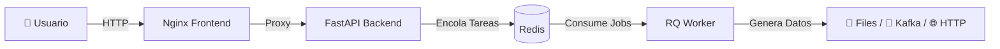

# 🏭 SynthDataFactory

[🇪🇸 Español](README.md) | [🇬🇧 English](README.en.md)

---

**The Ultimate Open Source Synthetic Data Generator.**

**SynthDataFactory** es una plataforma Open Source, contenerizada y basada en eventos para generar datasets complejos, simular tráfico IoT y probar sistemas de Big Data en tiempo real.

---

## 📋 Características Principales

Este no es un simple script de Python. Es una arquitectura completa de microservicios diseñada para escalabilidad y facilidad de uso.

- **🎨 Diseño Visual No-Code**: Interfaz web intuitiva (Vue.js + Bootstrap 5) para diseñar tus modelos de datos sin programar.

- **💾 Persistencia Inteligente**: 
  - **Auto-guardado**: Tu configuración se guarda automáticamente mientras trabajas.
  - **Plantillas Reutilizables**: Guarda, carga y duplica configuraciones con nombres personalizados.
  - **Exportar/Importar**: Comparte configuraciones entre equipos como archivos JSON.

- **📤 Multi-Salida (Sinks)**: Envía datos a donde necesites:
  - **📂 Archivos**: JSON, CSV, XML, TOML (Descarga directa).
  - **📡 IoT/Messaging**: MQTT, Kafka, RabbitMQ.
  - **🌐 Web**: HTTP Webhooks (POST).

- **🤖 Generación Inteligente**:
  - Tipos de datos realistas (Nombres, Emails, UUID, Geo, IPs).
  - Distribuciones ponderadas (Ej: 80% "OK", 20% "Error").
  - Rangos numéricos, fechas dinámicas y nulos configurables (% de suciedad).

- **⚡ Arquitectura No Bloqueante**: Usa Redis y Workers en segundo plano. Puedes lanzar 50 simulaciones simultáneas sin que la interfaz se congele.

- **🎛️ Control Total**: Start, Stop (inmediato) y monitorización de progreso en tiempo real.

- **🏭 Modo Multi-Sensor**: Simula flotas de dispositivos (1 a 1000+) inyectando IDs únicos rotativos.

- **🔍 Vista Previa**: Visualiza cómo será el JSON generado antes de lanzar la simulación.

- **✅ Validación Automática**: El sistema verifica que la configuración sea válida antes de ejecutar.

---

## 🏗️ Arquitectura

El sistema se compone de 4 contenedores orquestados:

- **Frontend (Nginx)**: Sirve la UI y actúa como Proxy Inverso.
- **API (FastAPI)**: Recibe las órdenes y gestiona los ficheros.
- **Redis**: Broker de mensajería y almacenamiento de estado en memoria.
- **Worker (Python RQ)**: El "obrero" que ejecuta la generación masiva de datos y gestiona las conexiones (Kafka, MQTT, etc.).



---

## 🚀 Instalación y Despliegue

### Requisitos Previos

- Docker y Docker Compose instalados.

### Pasos

1. **Clonar el repositorio**:

```bash
git clone https://github.com/JesusRosaB/SynthDataFactory.git
cd SynthDataFactory
```

2. **Arrancar los servicios**:

```bash
docker-compose up --build
```

3. **Acceder a la plataforma**: 

Abre tu navegador y ve a: 👉 **http://localhost**

---

## 📖 Guía de Uso

### 1. Configuración Global

Define el comportamiento general de la simulación:

- **Nombre**: Identificador de la tarea.
- **Registros**: Cuántas filas/mensajes quieres generar.
- **Delay**: Tiempo de espera entre mensajes (0 para máxima velocidad).
- **Dispositivos**: Si pones > 1, el sistema inyectará automáticamente un campo `sensor_id` que rotará entre IDs virtuales generados.

💡 **Tip**: Tu configuración se guarda automáticamente. Si recargas la página, todo permanecerá como lo dejaste.

### 2. Elegir Destino (Sink)

Selecciona dónde quieres que vayan los datos:

- **File**: Se guardarán en el servidor y podrás descargarlos desde la barra lateral. Soporta JSON, CSV, XML y TOML.
- **MQTT**: Requiere Host, Puerto y Topic.
- **Kafka**: Requiere Bootstrap Servers y Topic.
- **HTTP**: Requiere la URL del endpoint (hace POST del JSON).
- **RabbitMQ**: Requiere Host y nombre de la Queue.

### 3. Diseñar el Modelo (Schema)

Añade campos dinámicamente:

- **Tipos Primitivos**: Entero, Flotante (con min/max), Booleano.
- **Datos Semánticos**: Nombre, Email, Ciudad, UUID, IPv4.
- **Choice (Lista)**: Define tus propias opciones (Ej: Rojo,Verde,Azul).
  - **Pesos**: Puedes definir probabilidades (Ej: 0.8, 0.1, 0.1) para que "Rojo" salga el 80% de las veces.
- **Nulos**: Define un `% Null` para simular datos sucios o fallos de lectura.

🔍 **Usa la Vista Previa**: Antes de lanzar, haz clic en "Vista Previa" para ver cómo será el JSON generado.

### 4. Gestión de Plantillas

**SynthDataFactory** ahora incluye un potente sistema de gestión de configuraciones:

#### Guardar una Plantilla

1. Diseña tu configuración (pasos 1-3).
2. Ve a la pestaña **"Plantillas"** en el sidebar.
3. Haz clic en **"Guardar Plantilla"**.
4. Asigna un nombre descriptivo (Ej: "Sensores Temperatura", "Usuarios E-commerce").

#### Cargar una Plantilla

1. Ve a la pestaña **"Plantillas"**.
2. Haz clic sobre la plantilla que desees usar.
3. ¡Tu configuración se cargará instantáneamente!

#### Otras Operaciones

- **Duplicar** 📋: Crea una copia para experimentar sin perder la original.
- **Eliminar** 🗑️: Borra plantillas que ya no necesites.
- **Exportar** 💾: Descarga la configuración actual como JSON.
- **Importar** 📤: Carga configuraciones desde archivos JSON.

💡 **Caso de Uso**: Crea plantillas para cada proyecto o tipo de simulación (IoT, E-commerce, Logs, etc.) y reutilízalas cuando necesites.

### 5. Lanzar y Monitorizar

1. Pulsa **"LANZAR AHORA"**. El sistema validará tu configuración automáticamente.
2. Verás el progreso en tiempo real en la pestaña **"Activas"** del sidebar.
3. Puedes pausar la simulación en cualquier momento con el botón **STOP**.
4. Si elegiste "File", aparecerá el botón de descarga 📥 en la pestaña **"Archivos"** al finalizar.

---

## 🎯 Interfaz Mejorada

La nueva versión incluye una interfaz reorganizada con **3 pestañas** en el sidebar:

### 📌 Pestañas del Sidebar

1. **🎬 Activas**: 
   - Monitoriza simulaciones en curso.
   - Progreso en tiempo real.
   - Control de parada inmediata.

2. **📑 Plantillas**: 
   - Lista de configuraciones guardadas.
   - Vista rápida: número de registros y campos.
   - Acciones: Cargar, Duplicar, Eliminar.
   - Exportar/Importar configuraciones.

3. **📁 Archivos**: 
   - Archivos generados disponibles para descarga.
   - Botón de actualización de lista.
   - Descarga directa con un clic.

---

## 🛠️ Desarrollo Local

Si quieres modificar el código (Python o JS):

### Estructura de Carpetas

```
SynthDataFactory/
├── docker-compose.yml
├── backend/
│   ├── main.py          # API Endpoints
│   ├── worker.py        # Lógica del proceso en background
│   ├── core/
│   │   ├── generator.py # Lógica Faker/Random
│   │   └── sinks.py     # Conectores (Kafka, MQTT...)
└── frontend/
    ├── src/
    │   └── index.html   # UI Principal (Vue.js)
    └── nginx.conf       # Config Proxy
```

Los volúmenes de Docker están configurados para que los cambios en el código se reflejen al reiniciar el contenedor, aunque para nuevas librerías necesitas hacer un rebuild.

### Comandos Útiles

**Reiniciar forzando compilación (nuevas librerías)**:

```bash
docker-compose down
docker-compose build --no-cache
docker-compose up
```

**Ver logs en tiempo real**:

```bash
docker-compose logs -f
```

**Ver logs de un servicio específico**:

```bash
docker-compose logs -f worker
docker-compose logs -f backend
```

---

## 🆕 Novedades de la Última Versión

### v2.0 - "Smart Persistence"

✨ **Nuevas Características**:

- **🔄 Auto-guardado**: Las configuraciones se guardan automáticamente mientras trabajas.
- **📚 Sistema de Plantillas**: Guarda, carga y gestiona múltiples configuraciones.
- **📋 Duplicar Plantillas**: Experimenta sin perder tus configuraciones originales.
- **💾 Exportar/Importar**: Comparte configuraciones entre equipos o proyectos.
- **🔍 Vista Previa JSON**: Visualiza el resultado antes de ejecutar.
- **✅ Validación Mejorada**: El sistema verifica la configuración antes de lanzar.
- **🎨 Interfaz Reorganizada**: Sistema de pestañas para mejor organización.
- **🌐 Multi-idioma Mejorado**: Español e Inglés con persistencia de preferencia.

### Mejoras de UX

- Indicador visual de auto-guardado.
- Transiciones y animaciones suaves.
- Hover effects para mejor interactividad.
- Modals mejorados para acciones importantes.
- Mensajes de validación claros.

---

## 💡 Casos de Uso

### 1. Testing de Sistemas Big Data

Genera millones de registros realistas para probar tu pipeline de datos:

```
Configuración: 1.000.000 registros
Sink: Kafka Topic
Schema: user_id, timestamp, action, revenue
```

### 2. Simulación de Flota IoT

Simula 500 sensores enviando datos cada 5 segundos:

```
Configuración: 10.000 registros
Dispositivos: 500
Delay: 5 segundos
Sink: MQTT
Schema: temperatura, humedad, bateria, gps_lat, gps_lon
```

### 3. Datos de Prueba para Desarrollo

Genera CSVs con datos de usuarios para tu aplicación:

```
Configuración: 5.000 registros
Sink: File (CSV)
Schema: nombre, email, ciudad, edad, suscripcion
```

### 4. Load Testing de APIs

Bombardea tu API con tráfico realista:

```
Configuración: 100.000 registros
Delay: 0 (máxima velocidad)
Sink: HTTP Webhook
Schema: request_id, endpoint, method, payload
```

---

## 🤝 Contribución

¡Las Pull Requests son bienvenidas!

1. Haz un **Fork** del proyecto.
2. Crea tu rama de funcionalidad (`git checkout -b feature/AmazingFeature`).
3. Commit a tus cambios (`git commit -m 'Add some AmazingFeature'`).
4. Push a la rama (`git push origin feature/AmazingFeature`).
5. Abre una **Pull Request**.

### Áreas de Mejora

- 🔌 Nuevos conectores (PostgreSQL, MongoDB, S3, etc.)
- 📊 Visualización de datos generados
- 🔐 Autenticación y multi-usuario
- 📈 Métricas y estadísticas de simulaciones
- 🎲 Más tipos de datos (JSON anidado, Arrays, etc.)

---

## 📄 Licencia

Distribuido bajo la licencia MIT. Ver `LICENSE` para más información.

---

## 🙏 Agradecimientos

- [Faker](https://faker.readthedocs.io/) - Generación de datos realistas
- [FastAPI](https://fastapi.tiangolo.com/) - Framework API moderno
- [Vue.js](https://vuejs.org/) - Framework JavaScript progresivo
- [Redis](https://redis.io/) - Almacenamiento en memoria
- [Python-RQ](https://python-rq.org/) - Background jobs

---

**Hecho con ❤️ y mucho ☕ Café.**